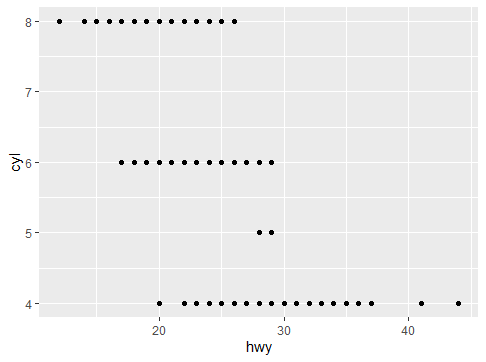
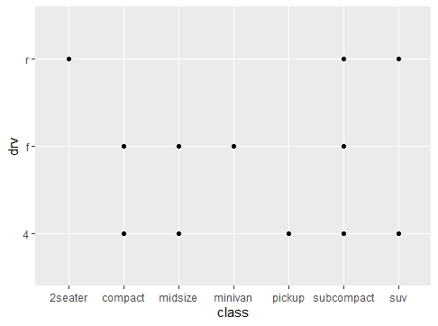
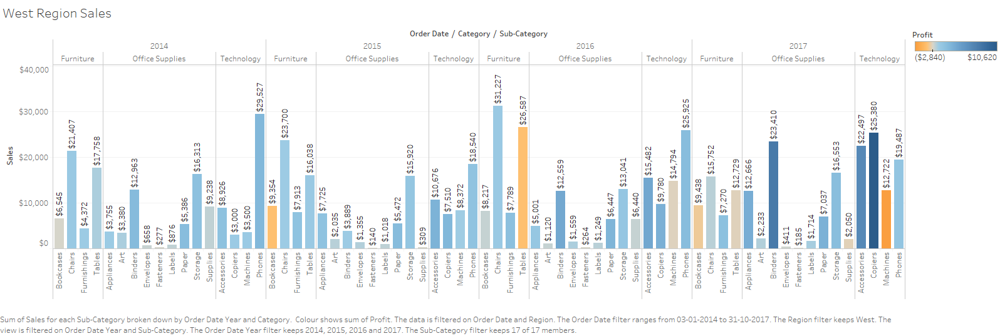
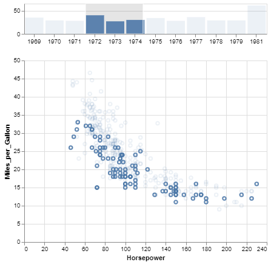

```{r setup, include=FALSE}
knitr::opts_chunk$set(echo = TRUE)
```

CS 625, Fall 2019


## Setting up R

The command below will load the tidyverse package.  If you have installed R, RStudio, and the tidyverse package, it should display a list of loaded packages and their versions.
```{r}
library(tidyverse)
```

library(tidyverse)
-- Attaching packages --------------------------------------- tidyverse 1.2.1 --
v ggplot2 3.2.1     v purrr   0.3.2
v tibble  2.1.3     v dplyr   0.8.3
v tidyr   0.8.3     v stringr 1.4.0
v readr   1.3.1     v forcats 0.4.0
-- Conflicts ------------------------------------------ tidyverse_conflicts() --
x dplyr::filter() masks stats::filter()
x dplyr::lag()    masks stats::lag()


## R Markdown 

1. *Create an ordered bulleted list with at least 3 items*

**Basic components of Computer System**

 1. Input/output unit
 2. Storage Unit
 3. Central Processing Unit(**CPU**)
 4. Arithmetic and Logic Unit(**ALU**)
 5. Control Unit

2. *Write a paragraph that demonstrates the use of italics, bold, bold italics, and inline code.*

**Lifi** stands for **Light Fidelity** and it is a *wireless optical networking* technology that uses light-emitting diodes(LEDs) for data transmission.Lifi is designed to use LED light bulbs similar to those currently  in use in  many energy-conscious homes and offices.Lifi data is transmitted by the ***LED bulbs*** and recieved by ***photoreceptors***. `Lifi provides higher speeds than Wifi`.


3. *Create an example of a fenced code block.*

~~~
CS-625- Data Visualization
~~~


4. *Create a level 4 heading*

#### Level-4 Heading Example

## R 

#### Data Visualization Exercises

1. *Run ggplot(data = mpg). What do you see?*

**ggplot** creates a coordinate system to which we can add layers. While running ```{r ggplot(data = mpg)}``` created no graph.Plots showed nothing.

2. *How many rows are in mpg? How many columns?*

There are **234** rows and **11** columns.

3. *What does the drv variable describe? Read the help for ?mpg to find out.*

**drv** represents f=front-wheel drive, r=rear wheel drive, 4=4wd 

4. *Make a scatterplot of hwy vs cyl.*




5. *What happens if you make a scatterplot of class vs drv? Why is the plot not useful?*

The scatterplot does not explain any useful relation between the parameters . It just shows points.



#### Workflow: basics Exercises

1. *Why does this code not work?*

```r
my_variable <- 10
my_varıable
```

Syntax error "*Error:attempt to use zero-length variable name*" occurs if we run the above code, the below code works correctly as we put **{}** for r

*correct code*:

```{r}
my_variable <- 10
my_variable
```

2. *Tweak each of the following R commands so that they run correctly:*

```r
library(tidyverse)

ggplot(data = mpg) + 
  geom_point(mapping = aes(x = displ, y = hwy))

fliter(mpg, cyl = 8)
filter(diamond, carat > 3)
```

*Correct code*:

*fliter* is actually **filter** and "=" is used instead of 1"==".

```r
library(tidyverse)

ggplot(data = mpg) + 
  geom_point(mapping = aes(x = displ, y = hwy))

filter(mpg, cyl == 8)
filter(diamond, carat > 3)
```

3. *Press Alt + Shift + K. What happens? How can you get to the same place using the menus?*

**Alt+Shift+K** is used for keyboard shortcuts. Another way of accessing is ***Tools> Keyboard shortcuts Help***.

## Tableau

*Insert your the image of your final bar chart here*




1. *What conclusions can you draw from the chart?*

Conclusions based on West Region Sales chart:

* **Binders** and **Copiers** made nice profit over the years.
* **Chairs** had a nice growth till 2016 and then had a downfall of the sales.
* **Appliances** had highest sales in the year 2017.
* **Labels** and **Paper** showed a constant surge in its sales over the time frame.
* **Supplies** had a drastic drop in sales from 2014 to 2015 and had a surge from 2015 to 2016.
* **Phones** had the highest sales in 2014 .While **Chairs** had highest sales in 2015 and 2016.
* **Copiers** were higly sold in the year 2017. 

## Observable and Vega-Lite

#### Intro to Observable notebook
*Insert the URL to your Observable notebook here*

https://observablehq.com/d/7188be5f0edca1d1

1. *What changes did you make to the notebook?*

Ran each cell in the notebook and changed few values in the exercises.

* Color is changed to black in cell-referencing exercise
* Sum function value is changed
* Background in HTML tag is changed to Orange
* Slider values are randomly changed

2. *What happens when you select a range of items in the scatterplot at the end of the notebook?*

Selection of particular region in the scatterplot shows car models as points of scatterplot,  Miles per gallon on x-axis, Horsepower on y-axis and a link to google-images of that particular car.

#### Intro to Vega-Lite notebook
*Insert the URL to your Vega-Lite Observable notebook here*

1. *What changes did you make to the notebook?*

Few values are changed in some charts and verified the reflected changes.

*Insert your saved chart image here*



## References

* https://www.rstudio.com/wp-content/uploads/2016/03/rmarkdown-cheatsheet-2.0.pdf
* https://www.youtube.com/watch?v=tKUufzpoHDE


***Make sure that you Knit your R Markdown into a GitHub-readable Markdown file that is synced with your GitHub repo.***
