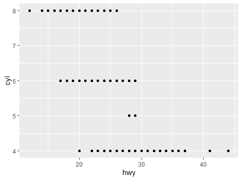

Homework 1
================
Srinath Botsa

CS 625, Fall 2019

## Setting up R

The command below will load the tidyverse package. If you have installed
R, RStudio, and the tidyverse package, it should display a list of
loaded packages and their
    versions.

``` r
library(tidyverse)
```

    ## -- Attaching packages ----------------------------------------------------------- tidyverse 1.2.1 --

    ## v ggplot2 3.2.1     v purrr   0.3.2
    ## v tibble  2.1.3     v dplyr   0.8.3
    ## v tidyr   0.8.3     v stringr 1.4.0
    ## v readr   1.3.1     v forcats 0.4.0

    ## -- Conflicts -------------------------------------------------------------- tidyverse_conflicts() --
    ## x dplyr::filter() masks stats::filter()
    ## x dplyr::lag()    masks stats::lag()

library(tidyverse) – Attaching packages ————————————— tidyverse 1.2.1 –
v ggplot2 3.2.1 v purrr 0.3.2 v tibble 2.1.3 v dplyr 0.8.3 v tidyr 0.8.3
v stringr 1.4.0 v readr 1.3.1 v forcats 0.4.0 – Conflicts ——————————————
tidyverse\_conflicts() – x dplyr::filter() masks stats::filter() x
dplyr::lag() masks stats::lag()

## R Markdown

1.  *Create an ordered bulleted list with at least 3 items*

**Basic components of Computer System**

1.  Input/output unit

2.  Storage Unit

3.  Central Processing Unit(**CPU**)

4.  Arithmetic and Logic Unit(**ALU**)

5.  Control Unit

6.  *Write a paragraph that demonstrates the use of italics, bold, bold
    italics, and inline code.*

**Lifi** stands for **Light Fidelity** and it is a *wireless optical
networking* technology that uses light-emitting diodes(LEDs) for data
transmission.Lifi is designed to use LED light bulbs similar to those
currently in use in many energy-conscious homes and offices.Lifi data is
transmitted by the ***LED bulbs*** and recieved by ***photoreceptors***.
`Lifi provides higher speeds than Wifi`.

3.  *Create an example of a fenced code block.*

<!-- end list -->

    CS-625- Data Visualization

4.  *Create a level 4 heading*

#### Level-4 Heading Example

## R

#### Data Visualization Exercises

1.  *Run ggplot(data = mpg). What do you see?*

**ggplot** creates a coordinate system to which we can add layers. While
running `{r ggplot(data = mpg)}` created no graph.Plots showed nothing.

2.  *How many rows are in mpg? How many columns?*

There are **234** rows and **11** columns.

3.  *What does the drv variable describe? Read the help for ?mpg to find
    out.*

**drv** represents f=front-wheel drive, r=rear wheel drive, 4=4wd

4.  *Make a scatterplot of hwy vs cyl.*



5.  *What happens if you make a scatterplot of class vs drv? Why is the
    plot not useful?*

The scatterplot does not explain any useful relation between the
parameters . It just shows points.


#### Workflow: basics Exercises

1.  *Why does this code not work?*

<!-- end list -->

``` r
my_variable <- 10
my_varıable
```

Syntax error “*Error:attempt to use zero-length variable name*” occurs
if we run the above code, the below code works correctly as we put
**{}** for r

*correct code*:

``` r
my_variable <- 10
my_variable
```

    ## [1] 10

2.  *Tweak each of the following R commands so that they run correctly:*

<!-- end list -->

``` r
library(tidyverse)

ggplot(data = mpg) + 
  geom_point(mapping = aes(x = displ, y = hwy))

fliter(mpg, cyl = 8)
filter(diamond, carat > 3)
```

*Correct code*:

*fliter* is actually **filter** and “=” is used instead of 1“==”.

``` r
library(tidyverse)

ggplot(data = mpg) + 
  geom_point(mapping = aes(x = displ, y = hwy))

filter(mpg, cyl == 8)
filter(diamond, carat > 3)
```

3.  *Press Alt + Shift + K. What happens? How can you get to the same
    place using the menus?*

**Alt+Shift+K** is used for keyboard shortcuts. Another way of accessing
is ***Tools\> Keyboard shortcuts Help***.

## Tableau

*Insert your the image of your final bar chart here*


1.  *What conclusions can you draw from the chart?*

Conclusions based on West Region Sales chart:

  - **Binders** and **Copiers** made nice profit over the years.
  - **Chairs** had a nice growth till 2016 and then had a downfall of
    the sales.
  - **Appliances** had highest sales in the year 2017.
  - **Labels** and **Paper** showed a constant surge in its sales over
    the time frame.
  - **Supplies** had a drastic drop in sales from 2014 to 2015 and had a
    surge from 2015 to 2016.
  - **Phones** had the highest sales in 2014 .While **Chairs** had
    highest sales in 2015 and 2016.
  - **Copiers** were higly sold in the year 2017.

## Observable and Vega-Lite

#### Intro to Observable notebook

*Insert the URL to your Observable notebook here*

<https://observablehq.com/d/7188be5f0edca1d1>

1.  *What changes did you make to the notebook?*

Ran each cell in the notebook and changed few values in the exercises.

  - Color is changed to black in cell-referencing exercise
  - Sum function value is changed
  - Background in HTML tag is changed to Orange
  - Slider values are randomly changed

<!-- end list -->

2.  *What happens when you select a range of items in the scatterplot at
    the end of the notebook?*

Selection of particular region in the scatterplot shows car models as
points of scatterplot, Miles per gallon on x-axis, Horsepower on y-axis
and a link to google-images of that particular car.

#### Intro to Vega-Lite notebook

*Insert the URL to your Vega-Lite Observable notebook here*

1.  *What changes did you make to the notebook?*

Few values are changed in some charts and verified the reflected
changes.

*Insert your saved chart image here*


## References

  - <https://www.rstudio.com/wp-content/uploads/2016/03/rmarkdown-cheatsheet-2.0.pdf>
  - <https://www.youtube.com/watch?v=tKUufzpoHDE>
